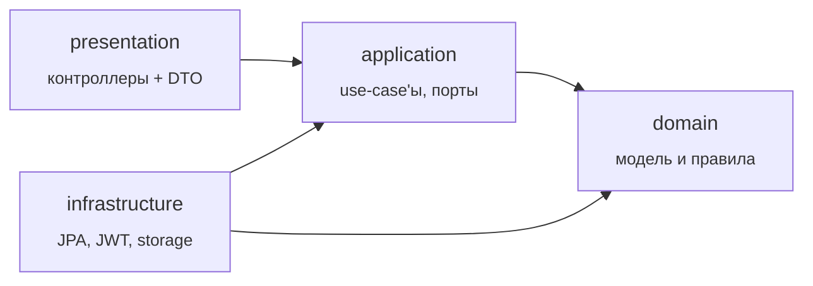
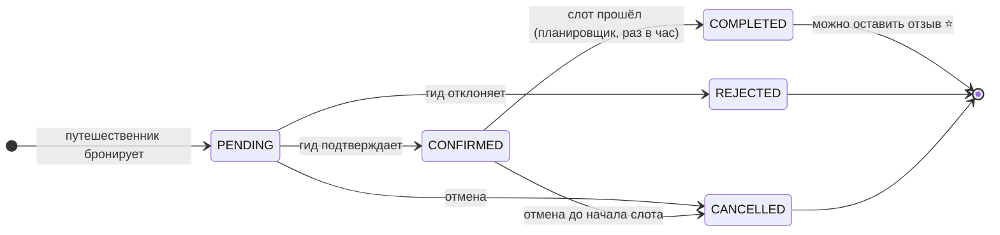
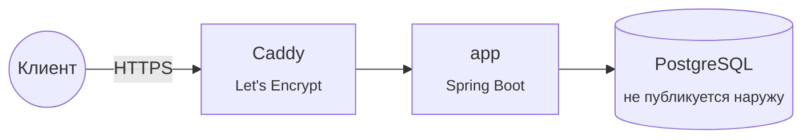

<div align="center">

# 🧭 EasyGuide Backend

**Backend платформы бронирования экскурсий у частных гидов**

[](https://kotlinlang.org/)
[](https://spring.io/projects/spring-boot)
[](https://adoptium.net/)
[](https://www.postgresql.org/)
[](https://flywaydb.org/)
[](https://www.docker.com/)
[](#-api)

[Возможности](#-возможности) •
[Быстрый старт](#-быстрый-старт) •
[Архитектура](#-архитектура) •
[API](#-api) •
[Тестовые данные](#-тестовые-данные) •
[Деплой](#-деплой) •
[Тесты](#-тесты)

</div>

---

## ✨ Возможности

| | |
|---|---|
| 🔐 **Аутентификация** | Регистрация, логин, JWT access-токены + ротируемые refresh-токены, logout |
| 👤 **Профили** | Редактирование профиля, переход в роль гида, публичный профиль гида |
| 🗺️ **Туры** | Создание, редактирование, публикация, архивация, фото, каталог с фильтрами |
| 📅 **Слоты** | Расписание тура: одиночные и пакетные слоты, отмена, календарь |
| 🎟️ **Бронирования** | Полный жизненный цикл брони, защита от двойного бронирования |
| ⭐ **Отзывы** | Отзыв после завершённой экскурсии, рейтинг тура |
| 📎 **Файлы** | Загрузка изображений (до 5 МБ) в локальное хранилище |
| ⏰ **Планировщик** | Ежечасное автозавершение прошедших броней |

## 🛠 Стек

- **Kotlin** + **Spring Boot 4.1.1** — Web MVC, Security, Validation, Scheduling
- **PostgreSQL** — основное хранилище, миграции через **Flyway**
- **Spring Data JPA / Hibernate** — доступ к данным
- **JWT** (JJWT) — аутентификация, **BCrypt** — хеширование паролей
- **springdoc-openapi** — автогенерация OpenAPI / Swagger UI
- **JUnit 5** + **Testcontainers** (PostgreSQL) + **ArchUnit** — тесты, в т.ч. архитектурные
- **Docker / Docker Compose** + **Caddy** — упаковка, локальный и прод-запуск с автоматическим HTTPS

---

## 🚀 Быстрый старт

> Нужен только установленный **Docker**.

```bash
docker compose up --build
```

Поднимает Postgres и приложение одной командой:

| Сервис | Адрес |
|---|---|
| API | http://localhost:8080 |
| Swagger UI | http://localhost:8080/swagger-ui.html |
| PostgreSQL | `localhost:5432` (`postgres` / `postgres`) |

По умолчанию `docker-compose.yaml` включает Spring-профиль `local`, поэтому
[тестовые данные](#-тестовые-данные) загружаются автоматически. Чтобы поднять дев-окружение
без них, переопределите профиль:

```bash
SPRING_PROFILES_ACTIVE= docker compose up --build
```

<details>
<summary><b>Запуск без Docker (через Gradle)</b></summary>

Нужны JDK 21 и запущенный PostgreSQL (по умолчанию `localhost:5432/backend`, `postgres`/`postgres`).

```bash
./gradlew bootRun --args='--spring.profiles.active=local'
```

</details>

<details>
<summary><b>Переменные окружения</b></summary>

| Переменная | По умолчанию | Описание |
|---|---|---|
| `PORT` | `8080` | Порт HTTP-сервера |
| `SPRING_DATASOURCE_URL` | `jdbc:postgresql://localhost:5432/backend` | URL базы |
| `SPRING_DATASOURCE_USERNAME` | `postgres` | Пользователь БД |
| `SPRING_DATASOURCE_PASSWORD` | `postgres` | Пароль БД |
| `APP_JWT_SECRET` | dev-значение | Секрет подписи JWT (**обязательно** переопределить вне dev) |
| `APP_JWT_EXPIRATION_MINUTES` | `15` | Время жизни access-токена |
| `APP_JWT_REFRESH_EXPIRATION_DAYS` | `30` | Время жизни refresh-токена |
| `APP_CORS_ALLOWED_ORIGIN` | `http://localhost:3000` | Разрешённый origin фронтенда |
| `APP_STORAGE_LOCAL_DIRECTORY` | `./uploads` | Каталог для загруженных файлов |
| `SPRING_PROFILES_ACTIVE` | — | `local` включает сидер тестовых данных |

</details>

---

## 🏛 Архитектура

Проект разбит на фичи — `user`, `tour`, `tourslot`, `booking`, `review` — плюс сквозной модуль
`shared`. Внутри каждой фичи четыре слоя с жёстким правилом зависимостей:



| Слой | Пакеты | Ответственность | Зависит от |
|---|---|---|---|
| **`domain`** | `model`, `repository`, `exception` | Бизнес-модель и правила. `repository` — только интерфейсы (порты) | **ни от чего** — ни Spring, ни JPA/Jackson |
| **`application`** | `usecase`, `dto`, `query`, `port` | Сценарии (один use-case — один `execute`) и порты: `Clock`, `PasswordHasher`, `TokenIssuer`, `FileStorage`, query-порты | `domain` |
| **`infrastructure`** | `persistence`, `security`, `storage`, `scheduler`, ... | Реализация портов: JPA-сущности и мапперы, адаптеры репозиториев, JWT/BCrypt, файлы, планировщик | `domain`, `application`, Spring/JPA |
| **`presentation`** | контроллеры, `dto` | HTTP-слой. Зовёт только `application` (`Result`/`View`-модели) | `application`* |

<sub>* Исключение — доменные enum'ы, используемые как типы `@RequestParam` для фильтров.</sub>

> [!TIP]
> Правило зависимостей и часть ограничений (repository — только интерфейсы, use-case — `*UseCase`
> с единственным `execute`, контроллеры не тянут `domain.model`) проверяются автоматически в
> [`ArchitectureTest`](src/test/kotlin/com/easyguide/backend/ArchitectureTest.kt).

**CQRS на read-side.** Кросс-агрегатные читающие сценарии (каталог туров, календарь слотов,
брони, публичный профиль гида) реализованы отдельными query-портами (`*Query`) с JPQL-проекциями
прямо во view-модели, минуя доменные объекты.

<details>
<summary><b>Структура проекта</b></summary>

```
src/main/kotlin/com/easyguide/backend/
├── user/          # регистрация, аутентификация, профили
├── tour/          # туры и их фото
├── tourslot/      # расписание (слоты) туров
├── booking/       # бронирования + планировщик автозавершения
├── review/        # отзывы и рейтинг
└── shared/        # общие порты, исключения, security, storage, сидер
    └── <feature>/
        ├── domain/          # model · repository · exception
        ├── application/     # usecase · dto · query · port
        ├── infrastructure/  # persistence · ...
        └── presentation/    # Controller + dto
```

</details>

### 🎟️ Жизненный цикл бронирования



---

## 📖 API

| | |
|---|---|
| **Swagger UI** | http://localhost:8080/swagger-ui.html |
| **OpenAPI JSON** | http://localhost:8080/v3/api-docs |

Авторизация — заголовок `Authorization: Bearer <access-token>`. В Swagger UI токен сохраняется
между перезагрузками страницы.

<details>
<summary><b>Обзор эндпоинтов</b></summary>

🔓 — доступно без авторизации

#### Auth — `/api/auth`
| Метод | Путь | Описание |
|---|---|---|
| `POST` | `/register` 🔓 | Регистрация |
| `POST` | `/login` 🔓 | Вход, выдача access + refresh |
| `POST` | `/refresh` 🔓 | Обновление пары токенов |
| `POST` | `/logout` 🔓 | Отзыв refresh-токена |
| `GET` | `/me` | Текущий пользователь |

#### Users — `/api/users`
| Метод | Путь | Описание |
|---|---|---|
| `PATCH` | `/me` | Обновить профиль |
| `POST` | `/me/become-guide` | Стать гидом |
| `GET` | `/{id}` 🔓 | Публичный профиль |

#### Tours
| Метод | Путь | Описание |
|---|---|---|
| `GET` | `/api/tours` 🔓 | Каталог туров |
| `GET` | `/api/tours/{id}` 🔓 | Карточка тура |
| `POST` | `/api/tours` | Создать тур |
| `PUT` | `/api/tours/{id}` | Обновить тур |
| `POST` | `/api/tours/{id}/publish` | Опубликовать |
| `POST` | `/api/tours/{id}/archive` | Архивировать |
| `GET` | `/api/my/tours` | Мои туры (гид) |
| `POST` | `/api/tours/{id}/photos` | Добавить фото |
| `DELETE` | `/api/tours/{id}/photos/{photoId}` | Удалить фото |

#### Slots
| Метод | Путь | Описание |
|---|---|---|
| `GET` | `/api/tours/{id}/slots` 🔓 | Расписание тура |
| `POST` | `/api/tours/{id}/slots` | Создать слот |
| `POST` | `/api/tours/{id}/slots/bulk` | Создать слоты пакетом |
| `POST` | `/api/slots/{id}/cancel` | Отменить слот |
| `DELETE` | `/api/slots/{id}` | Удалить слот |

#### Bookings
| Метод | Путь | Описание |
|---|---|---|
| `POST` | `/api/bookings` | Забронировать |
| `GET` | `/api/my/bookings` | Мои брони (путешественник) |
| `GET` | `/api/my/guide-bookings` | Брони на мои туры (гид) |
| `GET` | `/api/bookings/{id}` | Детали брони |
| `POST` | `/api/bookings/{id}/confirm` | Подтвердить |
| `POST` | `/api/bookings/{id}/reject` | Отклонить |
| `POST` | `/api/bookings/{id}/cancel` | Отменить |

#### Reviews
| Метод | Путь | Описание |
|---|---|---|
| `POST` | `/api/bookings/{id}/review` | Оставить отзыв |
| `GET` | `/api/tours/{id}/reviews` 🔓 | Отзывы о туре |

#### Files
| Метод | Путь | Описание |
|---|---|---|
| `POST` | `/api/files` | Загрузить файл (`multipart/form-data`, до 5 МБ) |

</details>

---

## 🧪 Тестовые данные

При запуске с Spring-профилем `local` (включён по умолчанию в `docker-compose.yaml`; также можно
задать через `SPRING_PROFILES_ACTIVE=local` или `--spring.profiles.active=local`) автоматически
загружаются тестовые данные —
[`LocalDataSeeder`](src/main/kotlin/com/easyguide/backend/shared/infrastructure/seed/LocalDataSeeder.kt).
Сидер идемпотентен: при повторном запуске проверяет наличие первого гида по email и, если данные
уже загружены, ничего не делает.

> [!NOTE]
> **Пароль для всех сидовых аккаунтов:** `Passw0rd!2026`

<table>
<tr><th>🧑‍🏫 Гиды</th><th>🎒 Путешественники</th></tr>
<tr valign="top"><td>

| Имя | Email | Город |
|---|---|---|
| Анна Иванова | `guide1@easyguide.local` | Москва |
| Дмитрий Соколов | `guide2@easyguide.local` | Санкт-Петербург |
| Мария Петрова | `guide3@easyguide.local` | Казань |

</td><td>

| Имя | Email |
|---|---|
| Иван Смирнов | `traveler1@easyguide.local` |
| Ольга Кузнецова | `traveler2@easyguide.local` |

</td></tr>
</table>

**Остальные данные:**

- 🗺️ **10 опубликованных туров** (по 3–4 на гида), 3 города, разные категории, у каждого — описание и 1–2 фото.
- 📅 **6 будущих слотов** у каждого тура (следующие ~30 дней).
- 🎟️ **10 бронирований**: по одному в статусах `PENDING`, `CONFIRMED`, `REJECTED`, `CANCELLED` и 6 в `COMPLETED` (на отдельных прошедших слотах).
- ⭐ **5 отзывов** — на 5 из 6 завершённых броней. Одна `COMPLETED`-бронь **намеренно оставлена без отзыва** — для проверки сценария «оставить отзыв».

---

## ☁️ Деплой

### Self-hosted VPS



1. Скопируйте `.env.prod.example` → `.env.prod` и заполните `POSTGRES_PASSWORD`,
   `APP_JWT_SECRET` (32+ случайных байта), `APP_CORS_ALLOWED_ORIGIN`, `DOMAIN`, `ACME_EMAIL`.
   Секрет можно сгенерировать так:
   ```bash
   openssl rand -base64 48
   ```
2. Направьте DNS-запись домена на IP сервера.
3. Запустите:
   ```bash
   docker compose -f docker-compose.prod.yml --env-file .env.prod up -d --build
   ```

HTTPS обеспечивает `caddy` — автоматически получает и продлевает сертификат Let's Encrypt для
`DOMAIN`; порт БД наружу не публикуется.

> [!IMPORTANT]
> **Дефолтов для секретов в `docker-compose.prod.yml` нет** — без переменной команда упадёт с
> явной ошибкой, а не тихо уйдёт на дев-значение.

### Railway / Render

Обе платформы собирают образ прямо из `Dockerfile` и сами терминируют HTTPS — `caddy` не нужен:

- добавьте Postgres как managed-аддон;
- пропишите `SPRING_DATASOURCE_URL` / `USERNAME` / `PASSWORD`, `APP_JWT_SECRET`,
  `APP_CORS_ALLOWED_ORIGIN` в настройках сервиса;
- приложение слушает порт из `PORT` (`server.port=${PORT:8080}`), как и ожидают Railway/Render.

**🌐 Живой стенд:** _(заполнить после деплоя)_

---

## ✅ Тесты

Интеграционные тесты используют **Testcontainers**, поэтому нужен запущенный Docker.

```bash
./gradlew test
```

Только архитектурные проверки:

```bash
./gradlew test --tests ArchitectureTest
```

| Уровень | Что покрыто |
|---|---|
| 🧩 Domain | Инварианты `User`, `Tour`, `TourSlot`, `Booking`, `Review` |
| ⚙️ Use-case | Сценарии auth, туров, бронирований — на in-memory репозиториях и fake-портах |
| 🗄️ Persistence | Адаптеры репозиториев на реальном PostgreSQL (Testcontainers) |
| 🌐 HTTP | `AuthController`, `TourController` |
| 🔀 Concurrency | Параллельное бронирование одного слота |
| 🏛 Architecture | Правило зависимостей слоёв (ArchUnit) |
